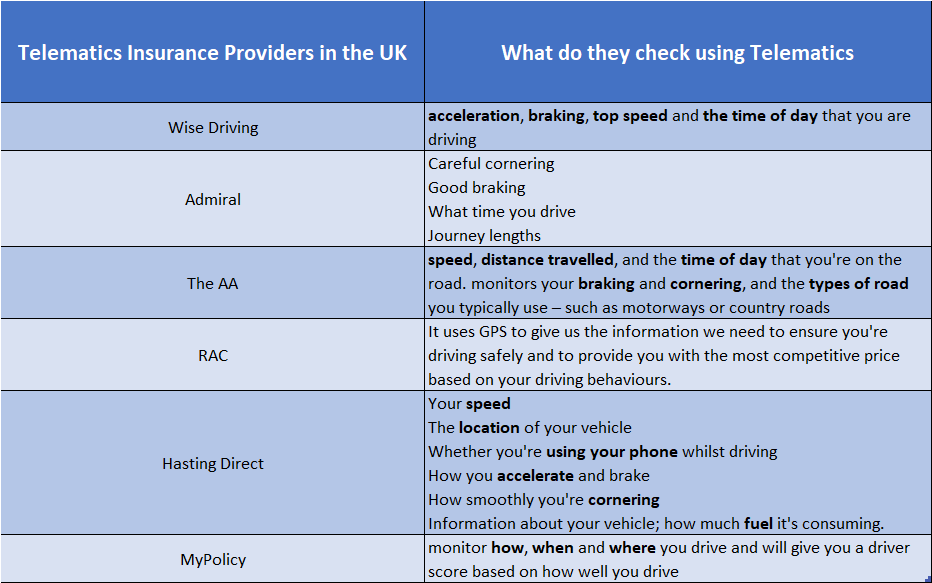
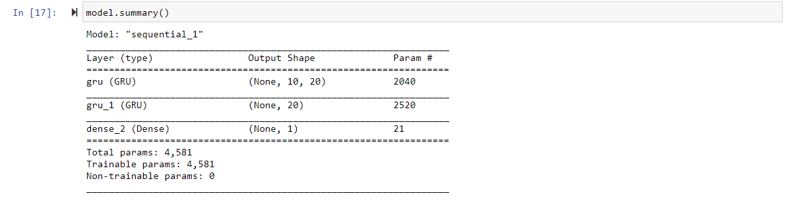
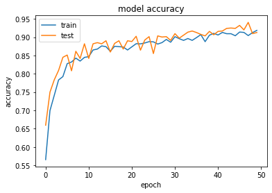

# AI for Insurance - How to Personalize Auto Insurance Using Telematics Data With Machine Learning on Google Cloud Platform

Many black-box insurance, also known as telematics insurance, leverage telematics data for offering cheap and flexible premium for their insurers. Based on continuously monitoring driver's behaviour and driving pattern, insurance providers can dynamically change the price. This provides opportunities for individual newly qualified yet careful drivers to demonstrate that they deserve a cheaper price than the one was set for the whole age group. In the UK, [there are 750,000 cars in the UK with black box fitted in 2017](https://www.fairerfinance.com/insights/blog/are-black-boxes-stiffling-competition-in-the-car-insurance-market). In 2016, there were only 25 telematics policies. [This number of more than doubled to 55 in 2017](https://www.thisismoney.co.uk/money/cars/article-7332163/The-number-telematics-insurance-policies-doubled-recent-years.html). The initial targeted drivers were newly qualified young drivers. Since then, black box providers are now targeting a range of drivers. 

Telematics devices allow the insurance providers to track insurers' driving through an app or by having a telematics box fitted in their vehicle. Enormous amount of data streamed by telematics devices can be analysed using cutting-edge machine learning models to help and mine insights into driver's behaviour. With the help of telematics data, owner of the vehicle can be proactively warned on abnormality before it becoming severe.

In this blog, we present an implemented solutions for predicting risk scores by analysing telematics data. We achived the following objectives:
- we designed a Google Cloud based solution architecture for training and serving machine learning on streamed telematics data streaming.
- we trained a set of machine learning models based on pre-collected [publicly available telematics data](https://www.kaggle.com/yunlevin/levin-vehicle-telematics) that are following the OBD-II standard. 
- we trained different kind of machine learning models, include supervised and unsupervised, that can demonstrate the capability of doing:
  - Vehicle predictive maintenance
  - Anormaly detection
  - Assessing risk in speed control

The solution is implemented on the following Google Cloud's services:
- Machine Learning:
  - AI Platform: a fully managed unified platform for training, serving and managing machine learning workflows.
- Data Stores:
  - Big Query: a fully-managed enterprise-level data warehouse that can be queried using SQL at scale of perabyte. In this case, we use BigQuery to store streamed telematics data for being processed and analysed.
  - Cloud Storage: a fully-managed object store. In this case, we use it to store model artefacts. 
  - Cloud SQL(SQL Server): a fully managed MS SQL Server as a backend relational database for Guidewire PolicyCenter(explained later).
- Model Hosting Services:
  - Cloud Run: a severless, fully-managed and highly scalable host environment for containerised application. In this case, we leverage Cloud Run to serve model prediction services run in docker containers. 

### Kafka

We adopt the widely used open source application messaging tool Kafka for buffering streamed-in telematics data that will later be consumed, and stored into BigQuery.

In this blog, we deployed Kafka onto GCP using [Bitnami](https://docs.bitnami.com/google/infrastructure/kafka/). Bitnami provide service for simplifying the deployment of Kafka brokers and ZooKeeper.  

### Guidewire

Guidewire is the widely used software in the P&C insurance industry. For several consecutive year to 2020, it has been recognised as a learder in Gartner Inc's [Magic Quadrant for P&C Core Platforms](https://www.guidewire.com/about-us/news-and-events/press-releases/20201111/guidewire-insurancesuite-positioned-leader-gartner). 

We have deployed Guidewire's Policy Center v10.0.3 a Windows VM hosted on Google Cloud. The Policy Center is configured to store its data in a MS SQL server database fully managed by Google Cloud.

We have integrated the machine learning prediction service into the policy quoting engine of the Policy Center so that it can query machine learning model deployed into Cloud Run containers using REST API for accessing predicted score on drivers's risk level or vehicle's maintenance history. The score can then be used as a basis for adjusting corresponding premium prices originally proposed by any Guidewire's quoting engine. 

The machine learning integrated quoting service can also be triggered remotely through SOAP API.   

### Solution Architecture 

All the functional components mentioned above is composed together to form the following architecture：


## Alternative Approaches:

### Cloud Pub/Sub

Google provides an alternative messaging service that is serverless, highly scalable, and fully-managed. Pub/Sub is a bundled service of Cloud IoT.

The foundamental difference between Kafka and Pub/Sub is in the way that the message delivery is handle
- Pub/Sub offers **at-least-once** message delivery and **best-effort ordering** to existing subscribers. 
- whereas [Kafka **guarantees exactly-once** delivery by default](https://kafka.apache.org/documentation/). Moreover, Kafka [guarantees](https://kafka.apache.org/documentation/#intro_guarantees) that any consumer of a given topic-partition will always read that partition's events **in exactly the same order** as they were written.

Which is better choise strictly depends on the way that downstream applications were designed for consuming and managing the buffered message. 

### Cloud IoT

In the proposed architecture, we did not include [Google Cloud IoT](https://cloud.google.com/solutions/iot), because we did not collect data from any actual telematics devices, instead from pre-collected publicly available data. Cloud IoT Core is a fully managed service on Google Cloud Platform that allows you to easily and securely connect, manage, and ingest data from millions of globally dispersed devices. 

## Sample Data Source

We trained the models using telematics data that follows the OBD-II standard. The telematics data is stored in Google Cloud's BigQuery, which constitutes of the following fields:

- DTC (diagnostic trouble codes), also known as OBDII codes, are your car's system for alerting you of vehicle issues.
- IAT is an acronym for "intake air temperature." The IAT sensor measures the air temperature that is going into your intake manifold. The colder the air, the more dense it is, and the more fuel you need to keep your engine working smoothly.
- MAP is an acronym for "manifold absolute pressure." The MAP sensor is a key component in a speed density fuel injection system, and measures pressure and absence of pressure (vacuum) at the intake manifold.
- KPL (kilometers per liter) is a unit of measurement that says how many units of distance you've travelled for each unit of fuel spent. It's simply an average of the fuel you've spent while driving your automobile, car, SUV, motorcycle, etc.
- MAF data is provided by a sensor used to determine the mass flow rate of air entering a fuel-injected internal combustion engine.    
- RPM, stands for revolutions per minute, and it's used as a measure of how fast any machine is operating at a given time
- Timing Advance (TADV) information transmitted from cell-phones, carried by the car drivers and passengers
- tPos Refers to throttle position
- eLoad, Engine load measures how much air (and fuel) you're sucking into the engine and then compares that value to the theoretical maximum.


## Kafka Setup and Config
- Broker/Producer/Consumer/Zookeeper/Simulators


## ML Modelling:
- Predictive Maintenance
- Competitive Driving Analysis
- Abnormally Detection


#### Competitive Driving Analysis

We have survey a few telematics insurance providers in the UK. We found from the result (as shown in the following figure) that one of the key areas that these companies want the telematics data to reveal is how the driver control speed while driving. Many young and newly qualified drivers carry the behavour of competitive driving. They tend to apply rapid change in speed (acceleration or deceleration).



The telematics data we collected from Kaggle contain timely record of various types of metrics of a vehicle when it was driving on a trip. We would like to use this data to train a machine learning model to be able to predict whether certain pattern of telematics recording is associated to risky speed control behavour. In other words, given a continuous of reading of telematics data for, e.g. 30 seconds, we want the model to predict if this driver is a risky speed controller. 

We have manually labeled the data based on domain knowledge and examine the pattern of the telematics data.


We use the following code to prepare training and test data.

```python
def foo(gr): 
 rows.append(gr)
rows = []
risky_trips.groupby(by=['deviceID', 'tripId']).apply(func=foo)
sample_trips = random.choices(rows, k=4)
rows = []
riskless_trips.groupby(by=['deviceID', 'tripId']).apply(func=foo)
sample_trips = sample_trips + random.choices(rows, k=4)
window_size = 5
examples = []
for i, r in enumerate(sample_trips):
    rolling_windows = list(r[feature_columns].rolling(window_size))
    if len(rolling_windows) >= window_size:
        rolling_windows = rolling_windows[window_size-1:]
        examples.append(rolling_windows)

X = []
y = []
for ex in examples:
    for r in ex:
        X.append(r[feature_columns[0:-1]].values)
        if r[['risky_speed_control']].values[0] == 1:
            y.append(1)
        else: 
            y.append(0)
X= np.array(X)
y= np.array(y)

from sklearn.model_selection import train_test_split
X_train, X_test, y_train, y_test = train_test_split( X, y, test_size=0.33, shuffle=True)

```

We have continuously windowed data into time frames. The size of each window can be configured. 

We formalised this problem as a time-framed based modelling. The input the trained model will take is a matrix where each row is a single telematics records at a time, in our case, a second, while each column is a metric collected by the telematics device, e.g. rpm, iat, eLoad, kpl. The most widely used machine learning model architecture is RNN (recurrent neural network), in particular, [LSTM](https://dl.acm.org/doi/10.1162/neco.1997.9.8.1735) and [GRU](https://arxiv.org/abs/1406.1078). 

In this blog, we will present a modelling example using GRU. Introduced in 2014, GRU aims to solve the vanishing gradient problem which comes with a standard recurrent neural network. GRU can also be considered as a variation on the LSTM because both are designed similarly and, in some cases, produce equally excellent results. It is not in the scope of this blog to provide detailed explanation on the mathematical foundation that GRU is built on. We recommend the reader this [tutorial](https://towardsdatascience.com/understanding-gru-networks-2ef37df6c9be) or the [original paper](https://arxiv.org/abs/1406.1078) for detail.

We use the following code to add two layers of GRU into a Keras tensorflow model:

```python

from keras.models import Sequential
from keras.layers import GRU
from keras.layers import LSTM
from keras.layers import Dense

model = Sequential()
model.add(GRU(20, activation='relu', return_sequences=True, input_shape=(window_size, len(feature_columns)-1)))
model.add(GRU(20, activation='relu'))
model.add(Dense(1, activation='sigmoid'))
model.compile(optimizer='adam', loss='binary_crossentropy', metrics=['accuracy'])

 ```

The two layers of GRU unites are followed by one feed forward layers and an output layer.



Below is the train and test accuracy monitored during the training process.



Once the model is trained we output the model as `pkl` file, embed it into a container and deploy to Cloud Run.

The deployment configuration and prediction service is created in the same way as predictive maintenance modelling. 

Below is a code example for the deployed model being triggered for prediction using Rest API.

```python
@app.route('/run-speed-control-analysis', methods=['POST'])
def predict():
    # Get the data from the POST request. 
    # data is a dictionary containing one entry for making a single predcition
    data = request.get_json(force=True)
    model_loaded = keras.models.load_model('./models/')
    query_live_data = '''
    SELECT *
    FROM `gft-bike-insurance.car_telematics_data.streamed_in_telematics_data`
    ORDER BY deviceID, tripId, timeStamp
    
    '''
    
    client = bigquery.Client()
    
    livedata = (read_bq_table_to_dataframe(client,query_live_data))
    livedata_copy = livedata.copy()
    livedata_copy = livedata_copy.drop(['labels'], axis=1)
    livedata_copy['timeStamp'] = pd.to_datetime(livedata_copy['timeStamp'])
    
    feature_columns_test = ['gps_speed', 'battery', 'cTemp', 'eLoad', 
                       'iat', 'imap', 'kpl', 'maf', 'rpm', 'speed', 
                       'tAdv', 'tPos', 'deviceID']
    
    agg_rows = []
    def agg(gr): 
        agg_rows.append(gr)
    livedata_copy.groupby(by=['deviceID', 'tripId']).apply(func=agg)
    
    window_size = 10
    examples = []
    for i, r in enumerate(agg_rows):
        print('progress: ', i)
        rolling_windows = list(r[feature_columns_test].rolling(window_size))
        if len(rolling_windows) >= window_size:
            rolling_windows = rolling_windows[window_size-1:]
            examples.append(rolling_windows)
            
    X = []
    device = []
    for ex in examples:
        for r in ex:
            X.append(r[feature_columns_test[0:-1]].values)
            device.append(r[feature_columns_test[-1]].iloc[0])
    X= np.array(X)
    device= np.array(device)
    
    predictions_live = model_loaded.predict_classes(X)
    
    risky_result = pd.DataFrame({'devices': device, 'degree_of_risky': predictions_live.flatten()})
    analysis_result=risky_result.groupby(by=['devices']).mean()
    analysis_result['deviceId'] = analysis_result.index
    analysis_result.to_gbq('car_telematics_data.speed_control_analysis', project_id='gft-bike-insurance',if_exists='replace')
        
        
    return 'All Done'
```

Here we asssume that the received telematics data is consumed and inserted into (by a Kafka consumer process) a BigQuery table `streamed_in_telematics_data`. The code above will read the data from the table, do the require feature engineering, and then trigger the loaded model. The predicted result will be saved into another BigQuery table `speed_control_analysis`.

This result table can later be queried by downstream application for retrieving risk score associated to a telematics devices belonged to a driver. 

```python
@app.route('/query-speed-control-analysis', methods=['POST'])
def get_score():
    # Get the data from the POST request.
    data = request.get_json(force=True)
    
    driver = data['driver']
    sc_score_query= '''
        SELECT degree_of_risky
        FROM `gft-bike-insurance.car_telematics_data.speed_control_analysis` 
        WHERE deviceId = {drivername}
    '''.format(drivername = driver)
    
    score = 0
    result = read_bq_table_to_dataframe(sc_score_query)
    if result is not None and result.empty is False:
        score = result.iloc[0]['degree_of_risky']
    
    response = {'driver':driver, "speed-control-score": score}
    
    return jsonify(response) 
```

The score and queried driver id will be send back as the final response to the request. 

## Model Deployment
- Cloud Run

## Generate Quotes from Guidewire
- Query score from Guidewire
- Generate quotes from Guidewire

## Conclusion
