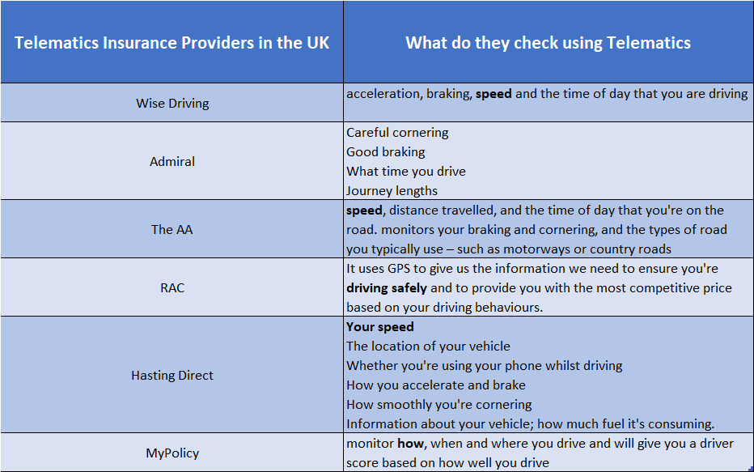
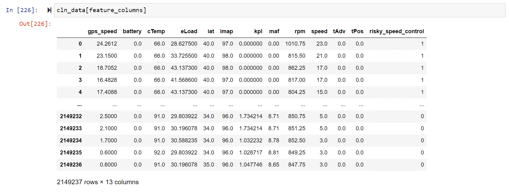
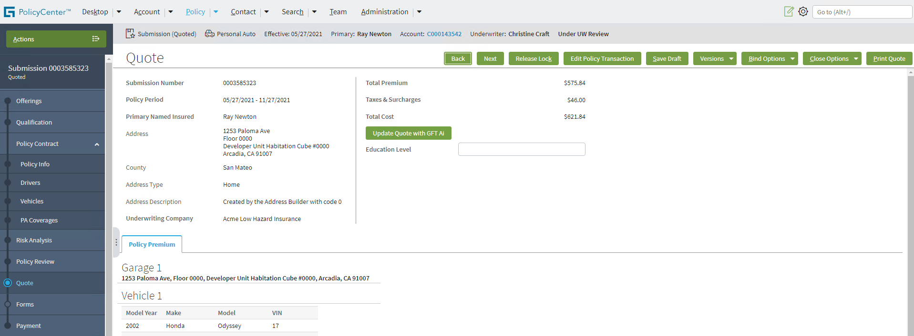
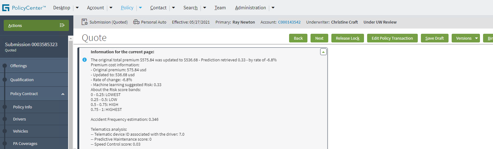

# AI for Insurance - How to Personalize Auto Insurance Using Telematics Data With Machine Learning on Google Cloud Platform

Many black-box insurance, also known as telematics insurance, leverage telematics data for offering cheap and flexible premium for their insurers. Based on continuously monitoring driver's behaviour and driving pattern, insurance providers can dynamically change the price. This provides opportunities for individual newly qualified yet careful drivers to demonstrate that they deserve a cheaper price than the one was set for the whole age group. In the UK, [there are 750,000 cars in the UK with black box fitted in 2017](https://www.fairerfinance.com/insights/blog/are-black-boxes-stiffling-competition-in-the-car-insurance-market). In 2016, there were only 25 telematics policies. [This number of more than doubled to 55 in 2017](https://www.thisismoney.co.uk/money/cars/article-7332163/The-number-telematics-insurance-policies-doubled-recent-years.html). The initial targeted drivers were newly qualified young drivers. Since then, black box providers are now targeting a range of drivers. 

Telematics devices allow the insurance providers to track insurers' driving through an app or by having a telematics box fitted in their vehicle. Enormous amount of data streamed by telematics devices can be analysed using cutting-edge machine learning models to help and mine insights into driver's behaviour. With the help of telematics data, owner of the vehicle can be proactively warned on abnormality before it becoming severe.

In this blog, we present an implemented solutions for predicting risk scores by analysing telematics data. We achived the following objectives:
- We designed a Google Cloud based solution architecture for training and serving machine learning on streamed telematics data streaming.
- We trained a set of machine learning models based on pre-collected [publicly available telematics data](https://www.kaggle.com/yunlevin/levin-vehicle-telematics) that are following the OBD-II standard. 
- We trained different kind of machine learning models, include supervised and unsupervised, that can demonstrate the capability of doing:
  - Vehicle predictive maintenance
  - Anormaly detection
  - Assessing risk in speed control

The solution is implemented on the following Google Cloud's services:
- Machine Learning:
  - AI Platform: a fully managed unified platform for training, serving and managing machine learning workflows.
- Data Stores:
  - Big Query: a fully-managed enterprise-level data warehouse that can be queried using SQL at scale of perabyte. In this case, we use BigQuery to store streamed telematics data for being processed and analysed.
  - Cloud Storage: a fully-managed object store. In this case, we use it to store model artefacts. 
  - Cloud SQL(SQL Server): a fully managed Microsoft SQL Server as a backend relational database for Guidewire PolicyCenter(explained later).
- Model Hosting Services:
  - Cloud Run: a severless, fully-managed and highly scalable host environment for containerised applications. In this case, we leverage Cloud Run to serve model prediction services running in docker containers. 

### Kafka

We adopt the widely used open source application messaging tool Kafka for buffering streamed-in telematics data that will later be consumed, and stored into BigQuery.

In this blog, we deployed Kafka onto GCP using [Bitnami](https://docs.bitnami.com/google/infrastructure/kafka/) which provides service for simplifying the deployment of Kafka brokers and ZooKeeper.  

### Guidewire

Guidewire is the widely used software in the P&C insurance industry. For several consecutive year to 2020, it has been recognised as a learder in Gartner Inc's [Magic Quadrant for P&C Core Platforms](https://www.guidewire.com/about-us/news-and-events/press-releases/20201111/guidewire-insurancesuite-positioned-leader-gartner). 

We have deployed Guidewire's Policy Center v10.0.3 a Windows VM hosted on Google Cloud. The Policy Center is configured to store its data in a MS SQL server database fully managed by Google Cloud.

We have integrated the machine learning prediction service into the policy quoting engine of the Policy Center so that it can query machine learning model deployed into Cloud Run containers using REST API for accessing predicted score on drivers's risk level or vehicle's maintenance history. The score can then be used as a basis for adjusting corresponding premium prices originally proposed by any Guidewire's quoting engine. 

The machine learning integrated quoting service can also be triggered remotely through SOAP API.   

### Solution Architecture 

All the functional components mentioned above is composed together to form the following architecture：


## Alternative Approaches:

### Cloud Pub/Sub

Google provides an alternative messaging service that is serverless, highly scalable, and fully-managed. Pub/Sub is a bundled service of Cloud IoT.

The foundamental difference between Kafka and Pub/Sub is in the way that the message delivery is handle
- Pub/Sub offers **at-least-once** message delivery and **best-effort ordering** to existing subscribers. 
- whereas [Kafka **guarantees exactly-once** delivery by default](https://kafka.apache.org/documentation/). Moreover, Kafka [guarantees](https://kafka.apache.org/documentation/#intro_guarantees) that any consumer of a given topic-partition will always read that partition's events **in exactly the same order** as they were written.

Which is better choise strictly depends on the way that downstream applications were designed for consuming and managing the buffered message. 

### Cloud IoT

In the proposed architecture, we did not include [Google Cloud IoT](https://cloud.google.com/solutions/iot), because we did not collect data from any actual telematics devices, instead from pre-collected publicly available data. Cloud IoT Core is a fully managed service on Google Cloud Platform that allows you to easily and securely connect, manage, and ingest data from millions of globally dispersed devices. 

## Sample Data Source

We trained the models using telematics data that follows the OBD-II standard. The telematics data is stored in Google Cloud's BigQuery, which constitutes of the following fields:

- DTC (diagnostic trouble codes), also known as OBDII codes, are your car's system for alerting you of vehicle issues.
- IAT is an acronym for "intake air temperature." The IAT sensor measures the air temperature that is going into your intake manifold. The colder the air, the more dense it is, and the more fuel you need to keep your engine working smoothly.
- MAP is an acronym for "manifold absolute pressure." The MAP sensor is a key component in a speed density fuel injection system, and measures pressure and absence of pressure (vacuum) at the intake manifold.
- KPL (kilometers per liter) is a unit of measurement that says how many units of distance you've travelled for each unit of fuel spent. It's simply an average of the fuel you've spent while driving your automobile, car, SUV, motorcycle, etc.
- MAF data is provided by a sensor used to determine the mass flow rate of air entering a fuel-injected internal combustion engine.    
- RPM, stands for revolutions per minute, and it's used as a measure of how fast any machine is operating at a given time
- Timing Advance (TADV) information transmitted from cell-phones, carried by the car drivers and passengers
- tPos Refers to throttle position
- eLoad, Engine load measures how much air (and fuel) you're sucking into the engine and then compares that value to the theoretical maximum.


## Kafka Setup and Config
- Broker/Producer/Consumer/Zookeeper/Simulators

We bootsrapped the kafka environment using [Bitnami Kafka Stack for Google Cloud Platform](https://console.cloud.google.com/marketplace/product/bitnami-launchpad/kafka?project=experiment-227714&folder=&organizationId=). 

We developed the telematics streaming analytics using two Kafka brokers with one Zookeeper. They all use machine type `n1-standard-1 (1 vCPU, 3.75 GB memory)`. 

#### Kafka-Python Library

We built a Kafka producer using the python library `Kafka-Python` which can be downloaded and installed from [`pypi`](https://pypi.org/project/kafka-python/). We use this producer to simulate the action of emitting telematics data. 

##### Producer

You can create a producer using the following:

```python

from kafka import KafkaProducer
producer = KafkaProducer(bootstrap_servers=['IP_BROKER_1:PORT', 'IP_BROKER_2:PORT'],
                         security_protocol='SASL_PLAINTEXT', 
                         sasl_mechanism='PLAIN', 
                         sasl_plain_username='XXXX', sasl_plain_password='PPPPPP')
						 
```

Once a producer is created, you can then start to produce data to the Kafka topic:

```python
producer.send('TELEMATICS_DEMO', b'raw_bytes1478')
```

We run the same code from different servers to simulate of sending telematics from different vehicle.

##### Consumer

To create a consumer you can using the following code:

```python
from kafka import KafkaConsumer

consumer = KafkaConsumer('TELEMATICS_DEMO',
                         group_id='Telematic_Grp',
                         bootstrap_servers=['IP_BROKER_1:PORT', 'IP_BROKER_2:PORT'],
                         security_protocol='SASL_PLAINTEXT', 
                         sasl_mechanism='PLAIN', 
                         auto_offset_reset='latest', #enable_auto_commit=False,
                         sasl_plain_username='XXXX', sasl_plain_password='PPPPPP')
						 
```

To consume the message from a Kafta Topic, you can create a for-loop to continuously check the topic, if a new message available, the consumer will pick up.

```python
for message in consumer:
    # message value and key are raw bytes -- decode if necessary!
    # e.g., for unicode: `message.value.decode('utf-8')`
    print("getting messages: ")
    print ("%s:%d:%d: key=%s value=%s" % (message.topic, message.partition,
                                          message.offset, message.key,
                                          message.value))
```

Because a consumer has to continuously and actively(note: not being triggered by) checking a topic, it is better to host it on a compute engine. Compare to Cloud Run or Cloud Function, both need to be triggered by another component. If message consumption is not important, you can also scheduled the message consumption with Cloud Composer, so that a pre-emptive compute engine can be started to consume a constant set of message each time, and terminated after completion.  

## ML Modelling

We are presenting two modelling cases using the telematics data. 

In the first part, we discuss the predictive maintenance modelling approach. We can apply the learned model to make on-stream prediction, i.e., whenever a telamtics record is received, we will ask the model to make prediction and update a driver to maintenance score table in BigQuery.

In the second part, we discuss the speed control risk analysis. This will train a model that predict on a windows of continuous reading of telematics data. This model can be scheduled to read from table of received telematics data and update a speed control score table based on result of the analysis.  

### Predictive Maintenance

Maintenance can be planned and carried out in different ways, and the three common
planning paradigms are corrective, preventive and predictive maintenance ([source](https://hh.diva-portal.org/smash/get/diva2:789498/FULLTEXT01.pdf)).
Corrective maintenance takes place when the fault or failure has occurred, so it often causes unexpected downtime of the services. 
Preventive maintenance or planned maintenance on the other hand is scheduled at certain intervals regardless of the actual status of the vehicles. 
However, the interval is very difficult to be determined precisely given different vehicles can be in very different conditions due to various factors. 
Therefore, predictive maintenance tends to cause either unnecessary repairs when the intervals are too small or cause vehicles not to 
get the needed repairs in time when the intervals are too big.

Compared with corrective maintenance and planned maintenance, predictive maintenance predicts the part and time for maintenance based on the monitoring of the actual 
conditions of the vehicles. 
By doing this, unnecessary replacements in preventive maintenance and unexpected repairs in corrective maintenance can be avoided.

In this study, we trained classification models to predict the vehicles which need to be considered for maintenance using the telematics data. 
Since the original data does not have a label indicating the status of the vehicles, 
we first used clustering to do the outlier detection which is to cluster the telematics data into two groups, i.e., outliers and not outliers, 
and then use the cluster labels as the target column for training the classifiers. 
Finally, we exported the model and deployed it on Cloud Run. 

#### Clustering

For clustering, we use the Density-Based Spatial Clustering of Applications with Noise (DBSCAN) to get the labels. 
This technique is one of the most common clustering algorithms which works based on density of object. 
It works based on two parameters: `epsilon` and `minimum samples`
- `epsilon` determines a specified radius that if includes enough number of points within
- `minimum samples` determine the minimum number of data points we want in a neighborhood to define a cluster

We dropped the columns "battery" and "tAdv" as we found these two columns are not very informative from our exploration. 
The data is shown as below


We then use the t-SNE technique to reduce the dimensionality and visualise the clusters. 


```python
Clus_dataSet2 = cluster_dataset2.copy()
Clus_dataSet2 = np.nan_to_num(Clus_dataSet2)
Clus_dataSet2 = StandardScaler().fit_transform(Clus_dataSet2)

# t-SNE for finding clusters in high-dimensional space
from sklearn.manifold import TSNE

tsne = TSNE(n_components=2, verbose=1, perplexity=50, n_iter=500)
tsne_results = tsne.fit_transform(Clus_dataSet2)


df_subset['tsne-2d-one'] = tsne_results[:,0]
df_subset['tsne-2d-two'] = tsne_results[:,1]
plt.figure(figsize=(8,8))
sns.scatterplot(
    x="tsne-2d-one", y="tsne-2d-two",
    data=df_subset,
    legend="full",
    alpha=0.5
)
```

Here is the visualization of the dataset and from it, we can see several distinctive clusters. 


Then, by changing the hyper-parameter `epsilon` of the DBSCAN clustering models, we tried to find the best match which can 
label the clusters matching the visualisation.

```python
# search for the best eps for this case
min_samples= 10
for eps in [0.05, 0.1, 0.2, 0.3, 0.5, 1.0, 1.5, 2.0, 2.5, 3.0, 3.5, 4.0, 5.0]:
    print('epsilon is: ', eps, '; minmum samples is: ', min_samples)
    dbscan = DBSCAN(eps=eps , min_samples=min_samples)
    dbscan.fit(Clus_dataSet2)
    print(set(dbscan.labels_))
    cluster_dataset2["labels"]=dbscan.labels_
    df_subset["labels"]=dbscan.labels_
    print(cluster_dataset2.labels.value_counts())
    
    
    plt.figure(figsize=(8,8))
    sns.scatterplot(
        x="tsne-2d-one", y="tsne-2d-two",
        hue='labels',
        palette=sns.color_palette( n_colors=len(set(dbscan.labels_))),
        data=df_subset,
        legend="full",
        alpha=0.5
    )
    plt.show()
```

It was found that when epsilon = 3.0, the clustering results matches the visualisation of the clusters the best, which is 
shown in the figure below.


Therefore, we set the cluster labels for the model with `epsilon` = 3.0 and `min_samples` = 10 as the target column for training 
the classifiers in the next step.

```python
dbscan = DBSCAN(eps=3.0 , min_samples=min_samples)
dbscan.fit(Clus_dataSet2)
cluster_dataset2["labels"]=dbscan.labels_
```

#### Classification Using the Cluster Labels

We trained our xgboost classifier using the script below. First, we imported the required packages. Then, selected the 
feature columns and target column, split the data into datasets for training and testing, and trained the classifier 
with the training dataset.


```python
try:
    import xgboost
except ImportError as ex:
    print("Error: the xgboost library is not installed.")
    xgboost = None
from sklearn.model_selection import train_test_split
from sklearn import metrics
X = cluster_dataset2.drop(['labels'], axis=1)
y = cluster_dataset2.labels
X_train, X_test, y_train, y_test = train_test_split(X, y, test_size=0.3, random_state=3)
xgb_clr = xgboost.XGBClassifier()
xgb_clr.fit(X_train, y_train)


```

We used the trained model to make predictions for unseen test dataset. 
Then, we printed the confusion matrix and the evaluation metrics.
It was shown that the model can predict the labels for the total 3,000 data entries correctly.


#### Export and Deploy the Model

After we have trained the model in the above section, 
we can now export the model & serve the model from Cloud Run. We saved the model to a local model file by running the script below.

```python
xgb_clr.save_model('xgb_model.bst')
```

Then, to deploy a model on Cloud Run, we need the following files to be in one directory
- `app.py` - flask app for serving the model
- `Dockerfile` - for building Docker image according to specifics
- `requirements.txt` - a list of dependencies
- `service.yaml` - specification of the configuration of the deployment
- `xgb_model.bst`: the xgboost model file

Following these steps to deploy the model on Cloud Run
1. Make sure the current working directory is the directory containing the above-listed files. 
1. Then, we build a docker image by running 
`docker build -t gcr.io/gft-bike-insurance/predictive-maintenance:latest .`
1. After this, push the image into Google Container Registry (GCR) by running `docker push gcr.io/gft-bike-insurance/predictive-maintenance`
1. We can deploy the model image on Cloud Run using the Cloud Console or the service.yaml file and `gcloud beta run services replace` cli
1. Finally, we get the endpoint of the cloud run service ('https://predictive-maintenance-apnir7ajvq-nw.a.run.app' in this case)

After the model has been deployed on Cloud Run, we can run the following script to make requests.

```python
import subprocess
import json

endpoint = 'https://predictive-maintenance-apnir7ajvq-nw.a.run.app'
one_entry = {'cTemp': 81.0,
             'eLoad': 39.2156862745098,
             'iat': 43.0,
             'imap': 41.0,
             'kpl': 0.0,
             'maf': 2.87,
             'rpm': 791.0,
             'speed': 0.0,
             'tPos': 15.2941176470588}
output = subprocess.check_output("echo $(gcloud auth print-identity-token)", shell=True, text=True)
access_token = "Bearer " + output[:-1]

headers = {'Authorization': access_token}

response = requests.post(endpoint + '/run-predictive-maintenance', 
                         headers=headers, 
                         json=one_entry)
print(response.text)
```

The outcome was 0, meaning that this specific data entry is considered as normal so no special attention is required.

### Competitive Driving Analysis
### Abnormally Detection


#### Competitive Driving Analysis

We have survey a few telematics insurance providers in the UK. We found from the result (as shown in the following figure) that one of the key areas that these companies want the telematics data to reveal is how the driver control speed while driving. Many young and newly qualified drivers carry the behavour of competitive driving. They tend to apply rapid change in speed (acceleration or deceleration).



The telematics data we collected from Kaggle contain timely record of various types of metrics of a vehicle when it was driving on a trip. We would like to use this data to train a machine learning model to be able to predict whether certain pattern of telematics recording is associated to risky speed control behavour. In other words, given a continuous of reading of telematics data for, e.g. 30 seconds, we want the model to predict if this driver is a risky speed controller. 

We have manually labeled the data based on domain knowledge and examine the pattern of the telematics data.



We use the following code to prepare training and test data.

```python
def foo(gr): 
 rows.append(gr)
rows = []
risky_trips.groupby(by=['deviceID', 'tripId']).apply(func=foo)
sample_trips = random.choices(rows, k=4)
rows = []
riskless_trips.groupby(by=['deviceID', 'tripId']).apply(func=foo)
sample_trips = sample_trips + random.choices(rows, k=4)
window_size = 5
examples = []
for i, r in enumerate(sample_trips):
    rolling_windows = list(r[feature_columns].rolling(window_size))
    if len(rolling_windows) >= window_size:
        rolling_windows = rolling_windows[window_size-1:]
        examples.append(rolling_windows)

X = []
y = []
for ex in examples:
    for r in ex:
        X.append(r[feature_columns[0:-1]].values)
        if r[['risky_speed_control']].values[0] == 1:
            y.append(1)
        else: 
            y.append(0)
X= np.array(X)
y= np.array(y)

from sklearn.model_selection import train_test_split
X_train, X_test, y_train, y_test = train_test_split( X, y, test_size=0.33, shuffle=True)

```

We have continuously windowed data into time frames. The size of each window can be configured. 

We formalised this problem as a time-framed based modelling. The input the trained model will take is a matrix where each row is a single telematics records at a time, in our case, a second, while each column is a metric collected by the telematics device, e.g. rpm, iat, eLoad, kpl. The most widely used machine learning model architecture is RNN (recurrent neural network), in particular, [LSTM](https://dl.acm.org/doi/10.1162/neco.1997.9.8.1735) and [GRU](https://arxiv.org/abs/1406.1078). 

In this blog, we will present a modelling example using GRU. Introduced in 2014, GRU aims to solve the vanishing gradient problem which comes with a standard recurrent neural network. GRU can also be considered as a variation on the LSTM because both are designed similarly and, in some cases, produce equally excellent results. It is not in the scope of this blog to provide detailed explanation on the mathematical foundation that GRU is built on. We recommend the reader this [tutorial](https://towardsdatascience.com/understanding-gru-networks-2ef37df6c9be) or the [original paper](https://arxiv.org/abs/1406.1078) for detail.

We use the following code to add two layers of GRU into a Keras tensorflow model:

```python

from keras.models import Sequential
from keras.layers import GRU
from keras.layers import LSTM
from keras.layers import Dense

model = Sequential()
model.add(GRU(20, activation='relu', return_sequences=True, input_shape=(window_size, len(feature_columns)-1)))
model.add(GRU(20, activation='relu'))
model.add(Dense(1, activation='sigmoid'))
model.compile(optimizer='adam', loss='binary_crossentropy', metrics=['accuracy'])

 ```

The two layers of GRU unites are followed by one feed forward layers and an output layer.


Below is the train and test accuracy monitored during the training process.


Once the model is trained we output the model as `pkl` file, embed it into a container and deploy to Cloud Run.

The deployment configuration and prediction service is created in the same way as predictive maintenance modelling. 

Below is a code example for the deployed model being triggered for prediction using Rest API.

```python
@app.route('/run-speed-control-analysis', methods=['POST'])
def predict():
    # Get the data from the POST request. 
    # data is a dictionary containing one entry for making a single predcition
    data = request.get_json(force=True)
    model_loaded = keras.models.load_model('./models/')
    query_live_data = '''
    SELECT *
    FROM `gft-bike-insurance.car_telematics_data.streamed_in_telematics_data`
    ORDER BY deviceID, tripId, timeStamp
    
    '''
    
    client = bigquery.Client()
    
    livedata = (read_bq_table_to_dataframe(client,query_live_data))
    livedata_copy = livedata.copy()
    livedata_copy = livedata_copy.drop(['labels'], axis=1)
    livedata_copy['timeStamp'] = pd.to_datetime(livedata_copy['timeStamp'])
    
    feature_columns_test = ['gps_speed', 'battery', 'cTemp', 'eLoad', 
                       'iat', 'imap', 'kpl', 'maf', 'rpm', 'speed', 
                       'tAdv', 'tPos', 'deviceID']
    
    agg_rows = []
    def agg(gr): 
        agg_rows.append(gr)
    livedata_copy.groupby(by=['deviceID', 'tripId']).apply(func=agg)
    
    window_size = 10
    examples = []
    for i, r in enumerate(agg_rows):
        print('progress: ', i)
        rolling_windows = list(r[feature_columns_test].rolling(window_size))
        if len(rolling_windows) >= window_size:
            rolling_windows = rolling_windows[window_size-1:]
            examples.append(rolling_windows)
            
    X = []
    device = []
    for ex in examples:
        for r in ex:
            X.append(r[feature_columns_test[0:-1]].values)
            device.append(r[feature_columns_test[-1]].iloc[0])
    X= np.array(X)
    device= np.array(device)
    
    predictions_live = model_loaded.predict_classes(X)
    
    risky_result = pd.DataFrame({'devices': device, 'degree_of_risky': predictions_live.flatten()})
    analysis_result=risky_result.groupby(by=['devices']).mean()
    analysis_result['deviceId'] = analysis_result.index
    analysis_result.to_gbq('car_telematics_data.speed_control_analysis', project_id='gft-bike-insurance',if_exists='replace')
        
        
    return 'All Done'
```

Here we asssume that the received telematics data is consumed and inserted into (by a Kafka consumer process) a BigQuery table `streamed_in_telematics_data`. The code above will read the data from the table, do the require feature engineering, and then trigger the loaded model. The predicted result will be saved into another BigQuery table `speed_control_analysis`.

This result table can later be queried by downstream application for retrieving risk score associated to a telematics devices belonged to a driver. 

```python
@app.route('/query-speed-control-analysis', methods=['POST'])
def get_score():
    # Get the data from the POST request.
    data = request.get_json(force=True)
    
    driver = data['driver']
    sc_score_query= '''
        SELECT degree_of_risky
        FROM `gft-bike-insurance.car_telematics_data.speed_control_analysis` 
        WHERE deviceId = {drivername}
    '''.format(drivername = driver)
    
    score = 0
    result = read_bq_table_to_dataframe(sc_score_query)
    if result is not None and result.empty is False:
        score = result.iloc[0]['degree_of_risky']
    
    response = {'driver':driver, "speed-control-score": score}
    
    return jsonify(response) 
```

The score and queried driver id will be send back as the final response to the request. 

## Generate Quotes from Guidewire

We tested the deployed Cloud Run machine learning services by sending API requests from a Guidewire PolicyCenter (v10.0.3). Guidewire is a widely used software platform in the P&C insurance industry. PolicyCenter, ClaimCenter, BillingCenter are the three applications provided by Guidewire that cover the most important business functions of any insurance provider.

We extended the PolicyCenter's policy quoting engine to send API request to the deployed machine learning services described above for deciding the quoted price of an insurance product (e.g., personal auto instrance) for a user. The machine learning services will response the request by providing query result on the score tables against the user in question. 

We added a trigger at the front-end web page where a quote has been calculated by the PolicyCenter's default quoting engine. 



When a user click the button for sending request to the machine learning. 

Guidewire will send out an API request with driver ID included in the request data:

```json
{
	"driver":"device7"
}
``` 

Once the response from the machine learning service is received:

```json
{"Speed_control_model": 0.03, "Vehicle_maintainance_model": 0.0, "Final_score": 0.26}
```

the PolicyCenter will provided an updated quote price:



The implemented architecture presented above is adaptable to include other machine learning services that can examine other aspects of insured user based on the telematics data. 


## Conclusion and Discussion

In this blog, we presented an implemented end-to-end solution on leveraging cutting edge machine learning algorithms do steaming analytic on telematics data. For demonstration purpose, We trained and deployed two machine learning models that analyse on telematics data sourced from simulated devices, and the result of analysis can be queried and leveraged by a user facing application for prvoding quoted price on insurance policy. This solution can be adapted to incorporate other machine learning algorithms and tool on analysing analytics data.

We anticipate that there are several related solution architectures implemented on Google Cloud or using alternative functional components such as Cloud IoT and PubSub. Different architectures or functional components have pros and cons depends on what requirements they aim to realise. 
