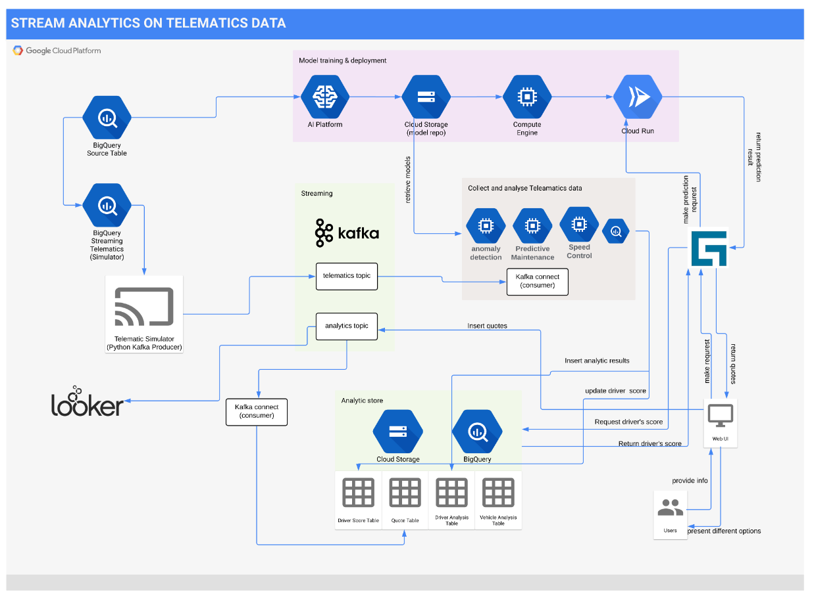

# AI for Insurance - How to Personalize Auto Insurance Using Telematics Data With Machine Learning on Google Cloud Platform

Many black-box insurance, also known as telematics insurance, leverage telematics data for offering cheap and flexible premium for their insurers. Based on continuously monitoring driver's behaviour and driving pattern, insurance providers can dynamically change the price. This provides opportunities for individual newly qualified yet careful drivers to demonstrate that they deserve a cheaper price than the one was set for the whole age group. In the UK, [there are 750,000 cars in the UK with black box fitted in 2017](https://www.fairerfinance.com/insights/blog/are-black-boxes-stiffling-competition-in-the-car-insurance-market). In 2016, there were only 25 telematics policies. [This number of more than doubled to 55 in 2017](https://www.thisismoney.co.uk/money/cars/article-7332163/The-number-telematics-insurance-policies-doubled-recent-years.html). The initial targeted drivers were newly qualified young drivers. Since then, black box providers are now targeting a range of drivers. 

Telematics devices allow the insurance providers to track insurers' driving through an app or by having a telematics box fitted in their vehicle. Enormous amount of data streamed by telematics devices can be analysed using cutting-edge machine learning models to help and mine insights into driver's behaviour. With the help of telematics data, owner of the vehicle can be proactively warned on abnormality before it becoming severe.

In this blog, we present an implemented solutions for predicting risk scores by analysing telematics data. We achived the following objectives:
- we designed a Google Cloud based solution architecture for training and serving machine learning on streamed telematics data streaming.
- we trained a set of machine learning models based on pre-collected [publicly available telematics data](https://www.kaggle.com/yunlevin/levin-vehicle-telematics) that are following the OBD-II standard. 
- we trained different kind of machine learning models, include supervised and unsupervised, that can demonstrate the capability of doing:
  - Vehicle predictive maintenance
  - Anormaly detection
  - Assessing risk in speed control

The solution is implemented on the following Google Cloud's services:
- Machine Learning:
  - AI Platform: a fully managed unified platform for training, serving and managing machine learning workflows.
- Data Stores:
  - Big Query: a fully-managed enterprise-level data warehouse that can be queried using SQL at scale of perabyte. In this case, we use BigQuery to store streamed telematics data for being processed and analysed.
  - Cloud Storage: a fully-managed object store. In this case, we use it to store model artefacts. 
  - Cloud SQL(SQL Server): a fully managed MS SQL Server as a backend relational database for Guidewire PolicyCenter(explained later).
- Model Hosting Services:
  - Cloud Run: a severless, fully-managed and highly scalable host environment for containerised application. In this case, we leverage Cloud Run to serve model prediction services run in docker containers. 

### Kafka

We adopt the widely used open source application messaging tool Kafka for buffering streamed-in telematics data that will later be consumed, and stored into BigQuery.

In this blog, we deployed Kafka onto GCP using [Bitnami](https://docs.bitnami.com/google/infrastructure/kafka/). Bitnami provide service for simplifying the deployment of Kafka brokers and ZooKeeper.  

### Guidewire

Guidewire is the widely used software in the P&C insurance industry. For several consecutive year to 2020, it has been recognised as a learder in Gartner Inc's [Magic Quadrant for P&C Core Platforms](https://www.guidewire.com/about-us/news-and-events/press-releases/20201111/guidewire-insurancesuite-positioned-leader-gartner). 

We have deployed Guidewire's Policy Center v10.0.3 a Windows VM hosted on Google Cloud. The Policy Center is configured to store its data in a MS SQL server database fully managed by Google Cloud.

We have integrated the machine learning prediction service into the policy quoting engine of the Policy Center so that it can query machine learning model deployed into Cloud Run containers using REST API for accessing predicted score on drivers's risk level or vehicle's maintenance history. The score can then be used as a basis for adjusting corresponding premium prices originally proposed by any Guidewire's quoting engine. 

The machine learning integrated quoting service can also be triggered remotely through SOAP API.   

### Solution Architecture 

All the functional components mentioned above is composed together to form the following architecture：

## Alternative Approaches:

### Cloud Pub/Sub

Google provides an alternative messaging service that is serverless, highly scalable, and fully-managed. Pub/Sub is a bundled service of Cloud IoT.

The foundamental difference between Kafka and Pub/Sub is in the way that the message delivery is handle
- Pub/Sub offers **at-least-once** message delivery and **best-effort ordering** to existing subscribers. 
- whereas [Kafka **guarantees exactly-once** delivery by default](https://kafka.apache.org/documentation/). Moreover, Kafka [guarantees](https://kafka.apache.org/documentation/#intro_guarantees) that any consumer of a given topic-partition will always read that partition's events **in exactly the same order** as they were written.

Which is better choise strictly depends on the way that downstream applications were designed for consuming and managing the buffered message. 

### Cloud IoT

In the proposed architecture, we did not include [Google Cloud IoT](https://cloud.google.com/solutions/iot), because we did not collect data from any actual telematics devices, instead from pre-collected publicly available data. Cloud IoT Core is a fully managed service on Google Cloud Platform that allows you to easily and securely connect, manage, and ingest data from millions of globally dispersed devices. 

## Sample Data Source

We trained the models using telematics data that follows the OBD-II standard. The telematics data is stored in Google Cloud's BigQuery, which constitutes of the following fields:

- DTC (diagnostic trouble codes), also known as OBDII codes, are your car's system for alerting you of vehicle issues.
- IAT is an acronym for "intake air temperature." The IAT sensor measures the air temperature that is going into your intake manifold. The colder the air, the more dense it is, and the more fuel you need to keep your engine working smoothly.
- MAP is an acronym for "manifold absolute pressure." The MAP sensor is a key component in a speed density fuel injection system, and measures pressure and absence of pressure (vacuum) at the intake manifold.
- KPL (kilometers per liter) is a unit of measurement that says how many units of distance you've travelled for each unit of fuel spent. It's simply an average of the fuel you've spent while driving your automobile, car, SUV, motorcycle, etc.
- MAF data is provided by a sensor used to determine the mass flow rate of air entering a fuel-injected internal combustion engine.    
- RPM, stands for revolutions per minute, and it's used as a measure of how fast any machine is operating at a given time
- Timing Advance (TADV) information transmitted from cell-phones, carried by the car drivers and passengers
- tPos Refers to throttle position
- eLoad, Engine load measures how much air (and fuel) you're sucking into the engine and then compares that value to the theoretical maximum.

## Kafka Setup and Config
- Broker/Producer/Consumer/Zookeeper/Simulators

## ML Modelling

### Predictive Maintenance

- Why do we want to do predictive maintenance
- How and What did we do the predictive maintenance

We first use clustering to cluster the telematics data into two groups and get the labels for the telematics data (outlier detection). 
Next, use the labels to train the classifiers which can give signals about whether the incoming telematics data is an outlier or not. 
Finally, we exported the model and deployed it on Cloud Run.

#### Clustering
We use DBSCAN (Density-Based Spatial Clustering of Applications with Noise) for clustering to get the labels. 
This technique is one of the most common clustering algorithms which works based on density of object. 

It works based on two parameters: epsilon and Minimum Points
- epsilon determines a specified radius that if includes enough number of points within, we call it dense area
- minimumSamples determine the minimum number of data points we want in a neighborhood to define a cluster.

Here is the visualization of the clustering results with the labels

#### Classification Using the Cluster Labels

#### Export and Deploy the model

In this notebook, we have explored the following areas:
- Used t-SNE technique to visualize the high-dimensional dataset, find distinctions among the dataset 
- Used DBSCAN to perform the outlier detection (clustering) against the unlabelled dataset. From the clustering, we got the labels of the instances
- We then used the labels to train classifiers to perform both multiclass classification and binary classification with XGBoost and Decision Tree algorithms. 
- Generally, the classifiers are good at predicting the labels except for the noises which might be due to their low occurrences (~0.1%)
- Finally, we exported the model and deployed it on Cloud Run

### Competitive Driving Analysis
### Abnormally Detection

## Model Deployment
- Cloud Run

## Generate Quotes from Guidewire
- Query score from Guidewire
- Generate quotes from Guidewire

## Conclusion
